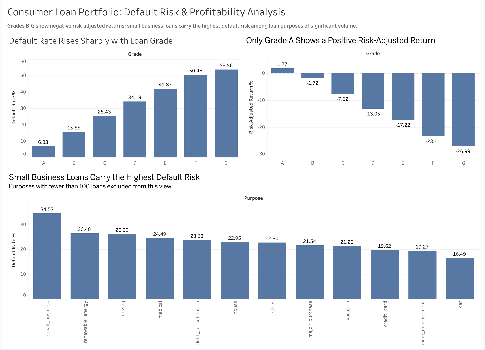

Loan Portfolio Risk & Profitability Analysis

Overview

Consumer lending institutions aim to maximise profitable loan growth while minimising credit losses. However, underwriting decisions often rely on broad borrower classifications that may overlook important differences in default risk across customer segments. This project analyses historical consumer loan performance data (Lending Club, 2016–2018) to identify which borrower and loan characteristics contribute most to elevated default risk and reduced portfolio profitability, and translates those findings into practical underwriting and pricing recommendations.

Full problem statement and business objectives: 
docs/00_problem_statement.md

Table of Contents:
Business Questions
Tech Stack & Methodology
Project Structure
Data
How to Run This Project
Findings
Dashboard
Key Recommendations
Skills demonstarted

Business Questions:
1) Which borrower segments generate the highest default risk?
2) Which loan characteristics are most associated with default, beyond credit grade alone?
3) How has portfolio risk changed over time (vintage analysis)?
4) Which segments provide the poorest risk-adjusted returns?
5) What is the potential financial impact of targeted underwriting changes?

Tech Stack & Methodology
Tools and their role in this project
SQL (PostgreSQL): Data cleaning, transformation, and  the core analytical queries answering the business questions above
Python (pandas, scipy): Statistical validation of SQL findings (e.g. significance testing) — not a duplicate EDA pass
Excel: Spot-check validation of key aggregates against SQL output
Tableau Public: Executive-facing interactive dashboard for stakeholder communication

Data flows one direction through this pipeline: raw CSV → SQL → Python validation → Tableau Public for the dashboard. Each stage's output is what the next stage consumes.

Project Structure
loan-portfolio-analysis/
├── data/
│   ├── raw/              # original data (gitignored — see Data section for download link)
│   ├── processed/        # cleaned output from SQL stage (gitignored)
│   ├── sample/           # small tracked sample so the repo is runnable out of the box
│   └── data_dictionary.md
├── sql/                  # schema, cleaning, and analysis queries
├── notebooks/            # exploratory validation notebooks
├── excel/                # validation workbook
├── tableau public/              # .pbix dashboard file
├── docs/                 # problem statement, data dictionary, findings write-up
└── images/               # dashboard screenshots for this README
Data

Source: Lending Club Loan Data (Kaggle). Raw dataset: 2,260,701 rows (2007–2018). This analysis uses a cleaned, scoped subset of 518,372 loans issued 2016–2018 with resolved outcomes (Fully Paid, Charged Off, or Default).

The full raw dataset is not committed to this repo (see .gitignore). To reproduce:

Download from the Kaggle link above
Place the CSV in data/raw/
Run sql/01_schema.sql then sql/02_cleaning.sql to reproduce the cleaned tables

A tracked sample is available at data/sample/ for quickly inspecting the data's shape without downloading the full file.

How to Run This Project:

git clone https://github.com/d-iriele/loan-portfolio-analysis.git
cd loan-portfolio-analysis
python -m venv .venv
source .venv/bin/activate
pip install -r requirements.txt

Then follow the steps in the Data section to populate data/raw/, and run the SQL scripts in order.

## Findings

Analysis of 518,372 loans (2016-2018) found that current pricing does not adequately compensate for credit risk: only Grade A loans generated a positive risk-adjusted return, while Grades B-G collectively lost money. Default risk rises from 6.8% (Grade A) to 53.6% (Grade G), and small business loans carry disproportionate risk within the loan-purpose dimension.

Full findings, methodology, and caveats: [`docs/findings_summary.md`](docs/findings_summary.md)

##Dashboard

Explore the live, interactive dashboard on Tableau Public: **[Loan Portfolio Risk & Profitability Analysis](https://public.tableau.com/app/profile/dennis.iriele/viz/LoanPortfolioRiskProfitabilityAnalysis/Dashboard1?publish=yes)**

   

   The dashboard includes an interactive filter — clicking any bar in the "Default Rate by Grade" chart filters the other two charts to that grade, letting you explore how default risk and risk-adjusted return move together across segments.

## Key Recommendations

1. Prioritize re-pricing and tighter underwriting for Grades B-E (the largest source of portfolio loss)
2. Exclude or substantially restrict lending to Grades F and G (breakeven pricing is impractical)
3. Introduce enhanced underwriting for small business borrowers
4. Use survival analysis or loan-seasoning methods in future vintage reporting, not raw year-over-year comparison

Full reasoning and evidence for each: [`docs/findings_summary.md`](docs/findings_summary.md)

## Skills Demonstrated

- **SQL**: complex aggregations, CASE WHEN logic, date parsing, schema design, data quality diagnosis and correction
- **Data cleaning & modeling**: star schema design (fact/dimension tables) for BI consumption
- **Python**: pandas-based exploratory analysis and validation
- **Data visualization**: interactive, cross-filtered dashboard in Tableau Public
- **Business analysis**: translating raw findings into prioritized, quantified recommendations
- **Documentation**: structured findings write-up with explicit limitations and caveats